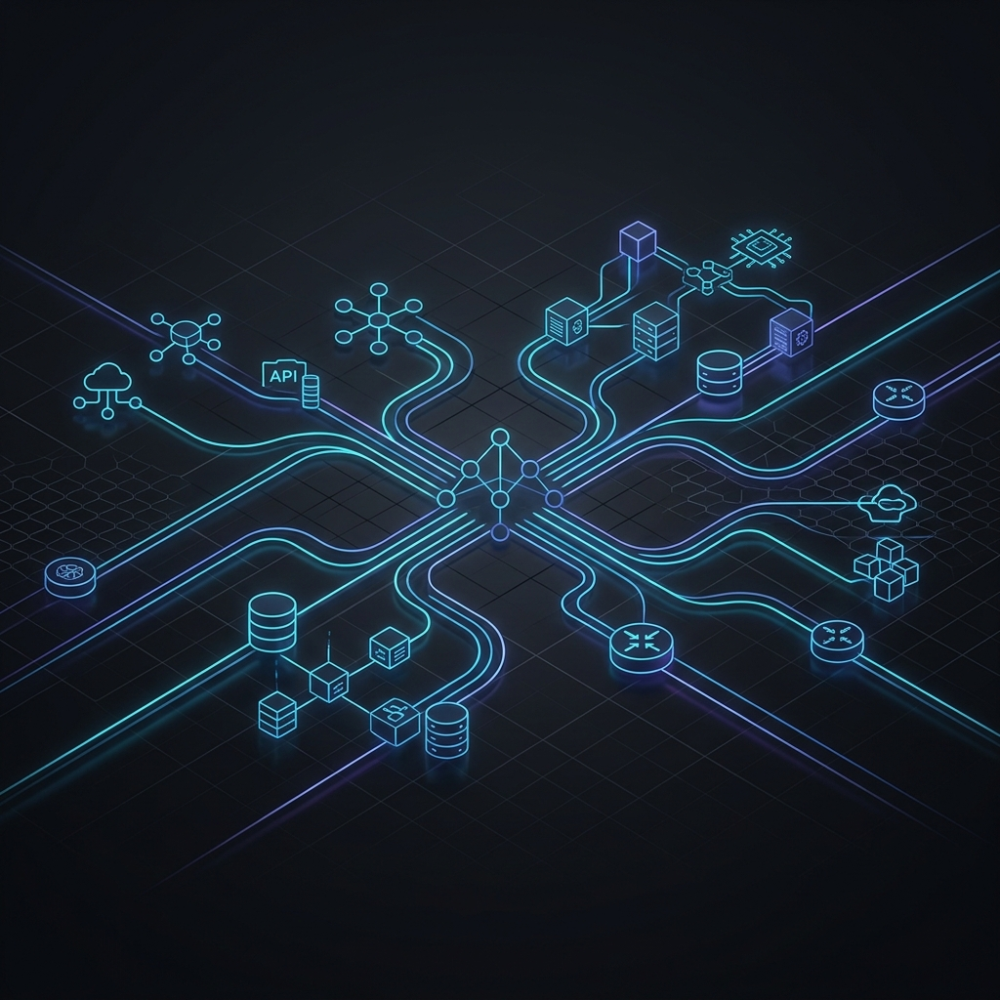

# Hi, I'm Chinmay Jog! 👋

## 🏗️ Platform & Cloud Solutions Architect
**20+ Years of Experience | Bridging Legacy Infrastructure & Cloud-Native Ecosystems**

I specialize in building **"Golden Paths"** for developers. My work focuses on Internal Developer Platforms (IDP), secure Cloud Foundations, and automated compliance. I don't just write scripts; I build end-to-end ecosystems that enable organizations to ship faster and more securely.

---

### 🌟 Featured Solutions

| Solution | Domain | Status |
| :--- | :--- | :--- |
| [**CloudOps Sandbox**](https://github.com/chinmaymjog/cloudops-sandbox) | Local R&D & Multi-Stack Orchestration | 🚀 **Production Ready** |
| [**Azure RBAC Insight**](https://github.com/chinmaymjog/azure-rbac-insight) | Security Analysis & Visualization | ✅ **Live** |
| [**Content-Ops**](https://github.com/chinmaymjog/content-ops) | Automation & Publishing Engine | 🛠️ **v1.0 Released** |

---

### 🛠️ Core Competencies

- **Platform Engineering**: Building IDPs to automate SCM, K8s, and Cloud onboarding.
- **Infrastructure as Code**: Production-grade Terraform & Bicep (AKS, Hub-and-Spoke, Hybrid).
- **Automation & Config**: Advanced Ansible playbooks for server hardening and app delivery.
- **DevSecOps**: Automated CIS hardening, secret scanning, and RBAC governance.

---

### 🧰 Technical Toolbelt

- **Cloud:**   
- **Platforms:**   
- **IaC:**  
- **Observability:**  

---

### 📫 Connect with me:
- **LinkedIn**: [Chinmay Jog](https://www.linkedin.com/in/28051984-chinmay-jog/)
- **Medium**: [Technical Deep-Dives](https://medium.com/@chinmaymjog)
- **Email**: [chinmaymjog@gmail.com](mailto:chinmaymjog@gmail.com)

---
*Building the future of infrastructure, one solution at a time.*
